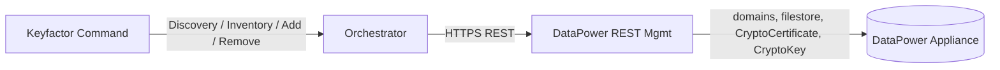

<h1 align="center" style="border-bottom: none">
    DataPower Universal Orchestrator Extension
</h1>

<p align="center">
  <!-- Badges -->

<a href="https://github.com/Keyfactor/ibm-datapower-orchestrator/releases"></a>


</p>

<p align="center">
  <!-- TOC -->
  <a href="#support">
    <b>Support</b>
  </a>
  ·
  <a href="#installation">
    <b>Installation</b>
  </a>
  ·
  <a href="#license">
    <b>License</b>
  </a>
  ·
  <a href="https://github.com/orgs/Keyfactor/repositories?q=orchestrator">
    <b>Related Integrations</b>
  </a>
</p>

## Overview

The IBM DataPower Universal Orchestrator manages certificates on IBM DataPower appliances. It targets the appliance's REST Management Interface (typically port `5554`) and uses the same store-path model across every job type: `<domain>\<directory>`.




## Compatibility

This integration is compatible with Keyfactor Universal Orchestrator version 10.4 and later.

## Support
The DataPower Universal Orchestrator extension is supported by Keyfactor. If you require support for any issues or have feature request, please open a support ticket by either contacting your Keyfactor representative or via the Keyfactor Support Portal at https://support.keyfactor.com.

> If you want to contribute bug fixes or additional enhancements, use the **[Pull requests](../../pulls)** tab.

## Requirements & Prerequisites

Before installing the DataPower Universal Orchestrator extension, we recommend that you install [kfutil](https://github.com/Keyfactor/kfutil). Kfutil is a command-line tool that simplifies the process of creating store types, installing extensions, and instantiating certificate stores in Keyfactor Command.


## DataPower Certificate Store Type

To use the DataPower Universal Orchestrator extension, you **must** create the DataPower Certificate Store Type. This only needs to happen _once_ per Keyfactor Command instance.


TODO Overview is a required section


#### Supported Operations

| Operation    | Is Supported                                                                                                           |
|--------------|------------------------------------------------------------------------------------------------------------------------|
| Add          | ✅ Checked        |
| Remove       | 🔲 Unchecked     |
| Discovery    | ✅ Checked  |
| Reenrollment | 🔲 Unchecked |
| Create       | 🔲 Unchecked     |

#### Store Type Creation

##### Using kfutil:
`kfutil` is a custom CLI for the Keyfactor Command API and can be used to create certificate store types.
For more information on [kfutil](https://github.com/Keyfactor/kfutil) check out the [docs](https://github.com/Keyfactor/kfutil?tab=readme-ov-file#quickstart)
   <details><summary>Click to expand DataPower kfutil details</summary>

   ##### Using online definition from GitHub:
   This will reach out to GitHub and pull the latest store-type definition
   ```shell
   # IBM Data Power
   kfutil store-types create DataPower
   ```

   ##### Offline creation using integration-manifest file:
   If required, it is possible to create store types from the [integration-manifest.json](./integration-manifest.json) included in this repo.
   You would first download the [integration-manifest.json](./integration-manifest.json) and then run the following command
   in your offline environment.
   ```shell
   kfutil store-types create --from-file integration-manifest.json
   ```
   </details>


#### Manual Creation
Below are instructions on how to create the DataPower store type manually in
the Keyfactor Command Portal
   <details><summary>Click to expand manual DataPower details</summary>

   Create a store type called `DataPower` with the attributes in the tables below:

   ##### Basic Tab
   | Attribute | Value | Description |
   | --------- | ----- | ----- |
   | Name | IBM Data Power | Display name for the store type (may be customized) |
   | Short Name | DataPower | Short display name for the store type |
   | Capability | DataPower | Store type name orchestrator will register with. Check the box to allow entry of value |
   | Supports Add | ✅ Checked | Check the box. Indicates that the Store Type supports Management Add |
   | Supports Remove | 🔲 Unchecked |  Indicates that the Store Type supports Management Remove |
   | Supports Discovery | ✅ Checked | Check the box. Indicates that the Store Type supports Discovery |
   | Supports Reenrollment | 🔲 Unchecked |  Indicates that the Store Type supports Reenrollment |
   | Supports Create | 🔲 Unchecked |  Indicates that the Store Type supports store creation |
   | Needs Server | ✅ Checked | Determines if a target server name is required when creating store |
   | Blueprint Allowed | 🔲 Unchecked | Determines if store type may be included in an Orchestrator blueprint |
   | Uses PowerShell | 🔲 Unchecked | Determines if underlying implementation is PowerShell |
   | Requires Store Password | 🔲 Unchecked | Enables users to optionally specify a store password when defining a Certificate Store. |
   | Supports Entry Password | 🔲 Unchecked | Determines if an individual entry within a store can have a password. |

   The Basic tab should look like this:

   

   ##### Advanced Tab
   | Attribute | Value | Description |
   | --------- | ----- | ----- |
   | Supports Custom Alias | Required | Determines if an individual entry within a store can have a custom Alias. |
   | Private Key Handling | Optional | This determines if Keyfactor can send the private key associated with a certificate to the store. Required because IIS certificates without private keys would be invalid. |
   | PFX Password Style | Default | 'Default' - PFX password is randomly generated, 'Custom' - PFX password may be specified when the enrollment job is created (Requires the Allow Custom Password application setting to be enabled.) |

   The Advanced tab should look like this:

   

   > For Keyfactor **Command versions 24.4 and later**, a Certificate Format dropdown is available with PFX and PEM options. Ensure that **PFX** is selected, as this determines the format of new and renewed certificates sent to the Orchestrator during a Management job. Currently, all Keyfactor-supported Orchestrator extensions support only PFX.

   ##### Custom Fields Tab
   Custom fields operate at the certificate store level and are used to control how the orchestrator connects to the remote target server containing the certificate store to be managed. The following custom fields should be added to the store type:

   | Name | Display Name | Description | Type | Default Value/Options | Required |
   | ---- | ------------ | ---- | --------------------- | -------- | ----------- |
   | ServerUsername | Server Username | Api UserName for DataPower. (or valid PAM key if the username is stored in a KF Command configured PAM integration). | Secret |  | 🔲 Unchecked |
   | ServerPassword | Server Password | A password for DataPower API access.  Used for inventory.(or valid PAM key if the password is stored in a KF Command configured PAM integration). | Secret |  | 🔲 Unchecked |
   | ServerUseSsl | Use SSL | Should be true, http is not supported. | Bool | true | ✅ Checked |
   | InventoryBlackList | Inventory Black List | Comma seperated list of alias values you do not want to inventory from DataPower. | String |  | 🔲 Unchecked |
   | Protocol | Protocol Name | Comma seperated list of alias values you do not want to inventory from DataPower. | String | https | ✅ Checked |
   | PublicCertStoreName | Public Cert Store Name | This probably will remain pubcert unless someone changed the default name in DataPower. | String | pubcert | ✅ Checked |
   | InventoryPageSize | Inventory Page Size | This determines the page size during the inventory calls. (100 should be fine). | String | 100 | ✅ Checked |

   The Custom Fields tab should look like this:

   


   ###### Server Username
   Api UserName for DataPower. (or valid PAM key if the username is stored in a KF Command configured PAM integration).


   > [!IMPORTANT]
   > This field is created by the `Needs Server` on the Basic tab, do not create this field manually.


   ###### Server Password
   A password for DataPower API access.  Used for inventory.(or valid PAM key if the password is stored in a KF Command configured PAM integration).


   > [!IMPORTANT]
   > This field is created by the `Needs Server` on the Basic tab, do not create this field manually.


   ###### Use SSL
   Should be true, http is not supported.

   
   


   ###### Inventory Black List
   Comma seperated list of alias values you do not want to inventory from DataPower.

   
   


   ###### Protocol Name
   Comma seperated list of alias values you do not want to inventory from DataPower.

   
   


   ###### Public Cert Store Name
   This probably will remain pubcert unless someone changed the default name in DataPower.

   
   


   ###### Inventory Page Size
   This determines the page size during the inventory calls. (100 should be fine).

   
   


   </details>

## Installation

1. **Download the latest DataPower Universal Orchestrator extension from GitHub.**

    Navigate to the [DataPower Universal Orchestrator extension GitHub version page](https://github.com/Keyfactor/ibm-datapower-orchestrator/releases/latest). Refer to the compatibility matrix below to determine the asset should be downloaded. Then, click the corresponding asset to download the zip archive.

   | Universal Orchestrator Version | Latest .NET version installed on the Universal Orchestrator server | `rollForward` condition in `Orchestrator.runtimeconfig.json` | `ibm-datapower-orchestrator` .NET version to download |
   | --------- | ----------- | ----------- | ----------- |
   | Older than `11.0.0` | | | `net6.0` |
   | Between `11.0.0` and `11.5.1` (inclusive) | `net6.0` | | `net6.0` |
   | Between `11.0.0` and `11.5.1` (inclusive) | `net8.0` | `Disable` | `net6.0` || Between `11.0.0` and `11.5.1` (inclusive) | `net8.0` | `LatestMajor` | `net8.0` |
   | `11.6` _and_ newer | `net8.0` | | `net8.0` | 

    Unzip the archive containing extension assemblies to a known location.

    > **Note** If you don't see an asset with a corresponding .NET version, you should always assume that it was compiled for `net6.0`.

2. **Locate the Universal Orchestrator extensions directory.**

    * **Default on Windows** - `C:\Program Files\Keyfactor\Keyfactor Orchestrator\extensions`
    * **Default on Linux** - `/opt/keyfactor/orchestrator/extensions`

3. **Create a new directory for the DataPower Universal Orchestrator extension inside the extensions directory.**

    Create a new directory called `ibm-datapower-orchestrator`.
    > The directory name does not need to match any names used elsewhere; it just has to be unique within the extensions directory.

4. **Copy the contents of the downloaded and unzipped assemblies from __step 2__ to the `ibm-datapower-orchestrator` directory.**

5. **Restart the Universal Orchestrator service.**

    Refer to [Starting/Restarting the Universal Orchestrator service](https://software.keyfactor.com/Core-OnPrem/Current/Content/InstallingAgents/NetCoreOrchestrator/StarttheService.htm).


6. **(optional) PAM Integration**

    The DataPower Universal Orchestrator extension is compatible with all supported Keyfactor PAM extensions to resolve PAM-eligible secrets. PAM extensions running on Universal Orchestrators enable secure retrieval of secrets from a connected PAM provider.

    To configure a PAM provider, [reference the Keyfactor Integration Catalog](https://keyfactor.github.io/integrations-catalog/content/pam) to select an extension and follow the associated instructions to install it on the Universal Orchestrator (remote).


> The above installation steps can be supplemented by the [official Command documentation](https://software.keyfactor.com/Core-OnPrem/Current/Content/InstallingAgents/NetCoreOrchestrator/CustomExtensions.htm?Highlight=extensions).


## Defining Certificate Stores


### Store Creation

#### Manually with the Command UI

<details><summary>Click to expand details</summary>

1. **Navigate to the _Certificate Stores_ page in Keyfactor Command.**

    Log into Keyfactor Command, toggle the _Locations_ dropdown, and click _Certificate Stores_.

2. **Add a Certificate Store.**

    Click the Add button to add a new Certificate Store. Use the table below to populate the **Attributes** in the **Add** form.

   | Attribute | Description                                             |
   | --------- |---------------------------------------------------------|
   | Category | Select "IBM Data Power" or the customized certificate store name from the previous step. |
   | Container | Optional container to associate certificate store with. |
   | Client Machine | The Client Machine field should contain the IP or Domain name and Port Needed for REST API Access.  For SSH Access, Port 22 will be used. |
   | Store Path | The store path uses the format domain\directory (e.g., default\pubcert, production-api\cert). The Discovery job can automatically find all valid store paths on an appliance. |
   | Orchestrator | Select an approved orchestrator capable of managing `DataPower` certificates. Specifically, one with the `DataPower` capability. |
   | ServerUsername | Api UserName for DataPower. (or valid PAM key if the username is stored in a KF Command configured PAM integration). |
   | ServerPassword | A password for DataPower API access.  Used for inventory.(or valid PAM key if the password is stored in a KF Command configured PAM integration). |
   | ServerUseSsl | Should be true, http is not supported. |
   | InventoryBlackList | Comma seperated list of alias values you do not want to inventory from DataPower. |
   | Protocol | Comma seperated list of alias values you do not want to inventory from DataPower. |
   | PublicCertStoreName | This probably will remain pubcert unless someone changed the default name in DataPower. |
   | InventoryPageSize | This determines the page size during the inventory calls. (100 should be fine). |

</details>


#### Using kfutil CLI

<details><summary>Click to expand details</summary>

1. **Generate a CSV template for the DataPower certificate store**

    ```shell
    kfutil stores import generate-template --store-type-name DataPower --outpath DataPower.csv
    ```
2. **Populate the generated CSV file**

    Open the CSV file, and reference the table below to populate parameters for each **Attribute**.

   | Attribute | Description |
   | --------- | ----------- |
   | Category | Select "IBM Data Power" or the customized certificate store name from the previous step. |
   | Container | Optional container to associate certificate store with. |
   | Client Machine | The Client Machine field should contain the IP or Domain name and Port Needed for REST API Access.  For SSH Access, Port 22 will be used. |
   | Store Path | The store path uses the format domain\directory (e.g., default\pubcert, production-api\cert). The Discovery job can automatically find all valid store paths on an appliance. |
   | Orchestrator | Select an approved orchestrator capable of managing `DataPower` certificates. Specifically, one with the `DataPower` capability. |
   | Properties.ServerUsername | Api UserName for DataPower. (or valid PAM key if the username is stored in a KF Command configured PAM integration). |
   | Properties.ServerPassword | A password for DataPower API access.  Used for inventory.(or valid PAM key if the password is stored in a KF Command configured PAM integration). |
   | Properties.ServerUseSsl | Should be true, http is not supported. |
   | Properties.InventoryBlackList | Comma seperated list of alias values you do not want to inventory from DataPower. |
   | Properties.Protocol | Comma seperated list of alias values you do not want to inventory from DataPower. |
   | Properties.PublicCertStoreName | This probably will remain pubcert unless someone changed the default name in DataPower. |
   | Properties.InventoryPageSize | This determines the page size during the inventory calls. (100 should be fine). |

3. **Import the CSV file to create the certificate stores**

    ```shell
    kfutil stores import csv --store-type-name DataPower --file DataPower.csv
    ```

</details>


#### PAM Provider Eligible Fields
<details><summary>Attributes eligible for retrieval by a PAM Provider on the Universal Orchestrator</summary>

If a PAM provider was installed _on the Universal Orchestrator_ in the [Installation](#Installation) section, the following parameters can be configured for retrieval _on the Universal Orchestrator_.

   | Attribute | Description |
   | --------- | ----------- |
   | ServerUsername | Api UserName for DataPower. (or valid PAM key if the username is stored in a KF Command configured PAM integration). |
   | ServerPassword | A password for DataPower API access.  Used for inventory.(or valid PAM key if the password is stored in a KF Command configured PAM integration). |

Please refer to the **Universal Orchestrator (remote)** usage section ([PAM providers on the Keyfactor Integration Catalog](https://keyfactor.github.io/integrations-catalog/content/pam)) for your selected PAM provider for instructions on how to load attributes orchestrator-side.
> Any secret can be rendered by a PAM provider _installed on the Keyfactor Command server_. The above parameters are specific to attributes that can be fetched by an installed PAM provider running on the Universal Orchestrator server itself.

</details>


> The content in this section can be supplemented by the [official Command documentation](https://software.keyfactor.com/Core-OnPrem/Current/Content/ReferenceGuide/Certificate%20Stores.htm?Highlight=certificate%20store).


## Discovering Certificate Stores with the Discovery Job
Discovery enumerates all domains on the appliance and emits a store path for every
certificate-relevant location, using a different detection method for `cert`/`pubcert`
(filestore presence) than for `sharedcert` (config-object ownership) — see
[Per-Domain vs Appliance-Wide](#per-domain-vs-appliance-wide) for why.

### How It Works

1. **Enumerate domains** — `GET /mgmt/domains/config/` returns every application domain on the appliance.
2. **Resolve directory filter** — the comma-separated **Directories to search** field on the Discovery job is parsed; if blank, the orchestrator falls back to `cert,pubcert,sharedcert`. Trailing colons (`cert:`) are stripped before matching.
3. **List directories per domain** — `GET /mgmt/filestore/{domain}` returns every filestore *location*. The trailing-colon names are matched against the resolved filter for `cert` and `pubcert` only; `sharedcert` is excluded from this step because every domain can read the appliance-wide `sharedcert:` location regardless of whether it actually owns anything there, so filestore presence can't tell domains apart.
4. **Emit `cert` / `pubcert` store paths** — `<domain>\cert` for every domain that has a `cert` directory; `default\pubcert` once (other domains' views of it are skipped because they alias the same physical data).
5. **Discover sharedcert ownership separately** — if `sharedcert` is in the resolved filter, the orchestrator additionally queries `GET /mgmt/config/{domain}/CryptoCertificate` for every domain and checks whether any object's `Filename` starts with `sharedcert:`. A domain that owns at least one such object gets its own `<domain>\sharedcert` store path; domains with none get no store, so this doesn't produce empty per-domain sharedcert stores on large appliances.
6. **Submit to Command** — the discovered paths are sent back via `SubmitDiscoveryUpdate` for operator approval.

The orchestrator is resilient to one inaccessible domain at either step: it logs a warning and continues with the rest.

### Configuration

Discovery only needs the appliance connection details — no store path is required:

| Field | Description |
|-------|-------------|
| **Client Machine** | DataPower appliance hostname/IP and REST mgmt port (e.g. `datapower.example.com:5554`) |
| **Server Username** | API username for DataPower (PAM-eligible) |
| **Server Password** | API password (PAM-eligible) |
| **Directories to search** | Comma-separated list of directory names to filter against (e.g. `cert,pubcert,sharedcert`). Leave blank to use the standard set. Custom DataPower scheme names can be included. |

The FlowLogger summary on the job's result records which filter list was applied:

```
[OK] ResolveDirsToSearch - source=user (key=dirs), dirs=[cert,sharedcert]
```

vs

```
[OK] ResolveDirsToSearch - source=default, dirs=[cert,pubcert,sharedcert]
```


## Store Path Format

Every Inventory, Management (Add / Remove), and Discovery operation uses the same path shape:

```
<domain>\<directory>
```

| Part | Description | Examples |
|------|-------------|----------|
| **Domain** | A DataPower application domain. Every appliance has at least `default`; additional domains are created for environment / application isolation. | `default`, `production-api`, `staging` |
| **Directory** | The certificate store directory within that domain. | `cert`, `pubcert`, `sharedcert` |

### Per-Domain vs Appliance-Wide

`pubcert` and `sharedcert` are physically appliance-wide on DataPower: their filestore
(`pubcert:` / `sharedcert:`) is a single store owned by `default`, and every domain
can read it. But **the two directories differ in how their contents are attributed
to a domain**, and the orchestrator follows DataPower's own model rather than
flattening both to `default`:

| Directory | Filestore scope | Config objects | Discovery emits as | Contents |
|-----------|------------------|-----------------|--------------------|----------|
| `cert` | Per-domain | Domain-scoped `CryptoCertificate` / `CryptoKey` objects | `<domain>\cert` (one per domain that has one) | Domain-specific certificates and private keys |
| `pubcert` | Appliance-wide | None — read straight from the filestore | `default\pubcert` (once per appliance) | Public / trusted CA certificates the appliance uses to verify other parties |
| `sharedcert` | Appliance-wide | Domain-scoped `CryptoCertificate` / `CryptoKey` objects, same as `cert` | `<domain>\sharedcert`, once per domain that owns a matching object | Shared identity certs used by appliance-level services or reused across domains (e.g. the management-interface TLS cert, an enterprise-wide signing cert) |

`pubcert` has no domain-scoped identity at all — there's nothing to distinguish one
domain's "view" of it from another's, so it's discovered and managed exclusively
under `default`. `sharedcert` is different: DataPower lets a `CryptoCertificate` /
`CryptoKey` object reference a `sharedcert://` file from **any** domain, not just
`default`, and that object's domain is where it actually lives from a management
perspective. The orchestrator treats it like `cert` — one store per owning domain —
rather than aggregating everything into a single `default\sharedcert` store. That
matters for two reasons:

* **Correctness of the alias key.** DataPower's real uniqueness key for a config
  object is `(domain, name)`, not just `name`. Two unrelated certs in two different
  domains can share an object name. Aggregating sharedcert into one domain-less store
  would risk treating those as "the same alias."
* **Renewal has to land on the right object.** Add / Renew writes the filestore file
  through `default` (DataPower rejects sharedcert filestore writes from any other
  domain), but updates the `CryptoCertificate` / `CryptoKey` config object in whichever
  domain it actually lives in. If Inventory reported a cross-domain object under a
  single `default\sharedcert` store, renewal would have no way to know which domain
  to update and would create a duplicate under `default` instead.

Domains that can merely *read* the shared filestore but don't own a
`CryptoCertificate` object referencing it are not discovered — Discovery checks for
an owning config object, not filestore presence, so this doesn't produce an empty
`<domain>\sharedcert` store per domain on large appliances.

So a 10-domain appliance where only `default` has sharedcert objects produces **12**
discovered store paths: 10 × `<domain>\cert` (one per domain with a `cert` directory)
plus `default\pubcert` and `default\sharedcert`. If an application domain also owns a
`CryptoCertificate` object referencing a `sharedcert://` file, that domain gets its
own `<domain>\sharedcert` store too, bringing the total to 13.

> **Add / Remove against `<non-default>\pubcert`** is rejected by the orchestrator
> before the call leaves, with `"You can only add to pubcert on the default domain"`.
> `sharedcert` has no such restriction on the store-path level — any
> `<domain>\sharedcert` is a valid target — but the underlying filestore write is
> always routed through `default` internally regardless of which domain the store
> path names.

## Inventory and Management

Inventory and Add / Remove jobs target a specific store path. The orchestrator branches on the directory:

- `<domain>\cert` and `<domain>\sharedcert` → reads `CryptoCertificate` config objects from `/mgmt/config/{domain}/CryptoCertificate` **in the domain named by the store path** — no cross-domain lookup, since Discovery already attributed the store to the correct owning domain. Filters to those whose `Filename` URI scheme matches the store (so a `<domain>\sharedcert` job ignores that domain's `cert:///` entries), and submits the certs.
- `default\pubcert` → reads files directly from the `pubcert:` filestore.

For Add / Remove against a `<domain>\sharedcert` store, the config-object update
targets that domain, but the underlying filestore write/delete for the
`sharedcert:///` file itself always goes through `default` — DataPower rejects
sharedcert filestore writes from any other domain context. This split is internal to
the orchestrator; operators just point Add/Renew at the store path Discovery gave
them and it resolves correctly.

Every job emits a `[FLOW:...]` breadcrumb summary that is appended to the `JobResult.FailureMessage` regardless of success or failure. The summary lists every step (Validate, ParseConfig, CreateApiClient, GetCerts.ParseResponse, GetCerts.SubmitInventory, ...) with timing and any error reason. Operators can read it directly from the job-history pane in Command without enabling Trace logging.

### Optional Store Properties

| Property | Description |
|----------|-------------|
| **Inventory Black List** | Comma-separated alias names to exclude from Inventory results (e.g. `system-cert,internal-test`). Case-insensitive. Empty by default. |
| **Inventory Page Size** | Maximum number of certs returned per Inventory submission. Defaults to `100`. |
| **Public Cert Store Name** | Name of the appliance's public-cert directory (default `pubcert`). Override only if the appliance has been re-configured. |
| **Protocol** | `https` (default) or `http`. Use `http` for lab appliances without the REST mgmt TLS profile configured. |

## Migration Note

* **Releases before 1.2.0** emitted `<each-domain>\pubcert` and
  `<each-domain>\sharedcert` from Discovery — N copies all aliasing the same physical
  store. If your environment approved any of those non-default entries as cert
  stores in Command, they became orphans once Discovery was corrected to emit
  `pubcert` and `sharedcert` under `default` only: Inventory against them returns
  nothing, and Add/Remove are rejected. Remove any leftover `<non-default>\pubcert`
  or `<non-default>\sharedcert` entries that current Discovery no longer produces.
* **1.2.0 through 1.2.1** correctly scoped `pubcert` to `default` only, but also
  treated `sharedcert` the same way — Inventory for `default\sharedcert` only ever
  queried `CryptoCertificate` objects in the `default` domain. Any sharedcert cert
  whose config object was created in an application domain instead of `default` was
  invisible to Inventory, and renewing it would have created a duplicate object
  under `default` rather than updating the original.
* **1.2.2** discovers and manages `sharedcert` per owning domain (see
  [Per-Domain vs Appliance-Wide](#per-domain-vs-appliance-wide)), matching only
  domains that actually own a `CryptoCertificate` object referencing a
  `sharedcert://` file — not every domain that can merely read the filestore, so this
  doesn't reintroduce the pre-1.2.0 clutter. If your appliance has sharedcert objects
  owned by application domains, re-run Discovery after upgrading: you should see new
  `<domain>\sharedcert` entries appear for those domains that weren't visible before.


## License

Apache License 2.0, see [LICENSE](LICENSE).

## Related Integrations

See all [Keyfactor Universal Orchestrator extensions](https://github.com/orgs/Keyfactor/repositories?q=orchestrator).