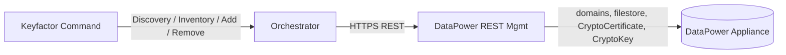

## Overview

The IBM DataPower Universal Orchestrator manages certificates on IBM DataPower appliances. It targets the appliance's REST Management Interface (typically port `5554`) and uses the same store-path model across every job type: `<domain>\<directory>`.



## Store Path Format

Every Inventory, Management (Add / Remove), and Discovery operation uses the same path shape:

```
<domain>\<directory>
```

| Part | Description | Examples |
|------|-------------|----------|
| **Domain** | A DataPower application domain. Every appliance has at least `default`; additional domains are created for environment / application isolation. | `default`, `production-api`, `staging` |
| **Directory** | The certificate store directory within that domain. | `cert`, `pubcert`, `sharedcert` |

### Per-Domain vs Appliance-Wide

`pubcert` and `sharedcert` are physically appliance-wide on DataPower: their filestore
(`pubcert:` / `sharedcert:`) is a single store owned by `default`, and every domain
can read it. But **the two directories differ in how their contents are attributed
to a domain**, and the orchestrator follows DataPower's own model rather than
flattening both to `default`:

| Directory | Filestore scope | Config objects | Discovery emits as | Contents |
|-----------|------------------|-----------------|--------------------|----------|
| `cert` | Per-domain | Domain-scoped `CryptoCertificate` / `CryptoKey` objects | `<domain>\cert` (one per domain that has one) | Domain-specific certificates and private keys |
| `pubcert` | Appliance-wide | None — read straight from the filestore | `default\pubcert` (once per appliance) | Public / trusted CA certificates the appliance uses to verify other parties |
| `sharedcert` | Appliance-wide | Domain-scoped `CryptoCertificate` / `CryptoKey` objects, same as `cert` | `<domain>\sharedcert`, once per domain that owns a matching object | Shared identity certs used by appliance-level services or reused across domains (e.g. the management-interface TLS cert, an enterprise-wide signing cert) |

`pubcert` has no domain-scoped identity at all — there's nothing to distinguish one
domain's "view" of it from another's, so it's discovered and managed exclusively
under `default`. `sharedcert` is different: DataPower lets a `CryptoCertificate` /
`CryptoKey` object reference a `sharedcert://` file from **any** domain, not just
`default`, and that object's domain is where it actually lives from a management
perspective. The orchestrator treats it like `cert` — one store per owning domain —
rather than aggregating everything into a single `default\sharedcert` store. That
matters for two reasons:

* **Correctness of the alias key.** DataPower's real uniqueness key for a config
  object is `(domain, name)`, not just `name`. Two unrelated certs in two different
  domains can share an object name. Aggregating sharedcert into one domain-less store
  would risk treating those as "the same alias."
* **Renewal has to land on the right object.** Add / Renew writes the filestore file
  through `default` (DataPower rejects sharedcert filestore writes from any other
  domain), but updates the `CryptoCertificate` / `CryptoKey` config object in whichever
  domain it actually lives in. If Inventory reported a cross-domain object under a
  single `default\sharedcert` store, renewal would have no way to know which domain
  to update and would create a duplicate under `default` instead.

Domains that can merely *read* the shared filestore but don't own a
`CryptoCertificate` object referencing it are not discovered — Discovery checks for
an owning config object, not filestore presence, so this doesn't produce an empty
`<domain>\sharedcert` store per domain on large appliances.

So a 10-domain appliance where only `default` has sharedcert objects produces **12**
discovered store paths: 10 × `<domain>\cert` (one per domain with a `cert` directory)
plus `default\pubcert` and `default\sharedcert`. If an application domain also owns a
`CryptoCertificate` object referencing a `sharedcert://` file, that domain gets its
own `<domain>\sharedcert` store too, bringing the total to 13.

> **Add / Remove against `<non-default>\pubcert`** is rejected by the orchestrator
> before the call leaves, with `"You can only add to pubcert on the default domain"`.
> `sharedcert` has no such restriction on the store-path level — any
> `<domain>\sharedcert` is a valid target — but the underlying filestore write is
> always routed through `default` internally regardless of which domain the store
> path names.

## Discovery

Discovery enumerates all domains on the appliance and emits a store path for every
certificate-relevant location, using a different detection method for `cert`/`pubcert`
(filestore presence) than for `sharedcert` (config-object ownership) — see
[Per-Domain vs Appliance-Wide](#per-domain-vs-appliance-wide) for why.

### How It Works

1. **Enumerate domains** — `GET /mgmt/domains/config/` returns every application domain on the appliance.
2. **Resolve directory filter** — the comma-separated **Directories to search** field on the Discovery job is parsed; if blank, the orchestrator falls back to `cert,pubcert,sharedcert`. Trailing colons (`cert:`) are stripped before matching.
3. **List directories per domain** — `GET /mgmt/filestore/{domain}` returns every filestore *location*. The trailing-colon names are matched against the resolved filter for `cert` and `pubcert` only; `sharedcert` is excluded from this step because every domain can read the appliance-wide `sharedcert:` location regardless of whether it actually owns anything there, so filestore presence can't tell domains apart.
4. **Emit `cert` / `pubcert` store paths** — `<domain>\cert` for every domain that has a `cert` directory; `default\pubcert` once (other domains' views of it are skipped because they alias the same physical data).
5. **Discover sharedcert ownership separately** — if `sharedcert` is in the resolved filter, the orchestrator additionally queries `GET /mgmt/config/{domain}/CryptoCertificate` for every domain and checks whether any object's `Filename` starts with `sharedcert:`. A domain that owns at least one such object gets its own `<domain>\sharedcert` store path; domains with none get no store, so this doesn't produce empty per-domain sharedcert stores on large appliances.
6. **Submit to Command** — the discovered paths are sent back via `SubmitDiscoveryUpdate` for operator approval.

The orchestrator is resilient to one inaccessible domain at either step: it logs a warning and continues with the rest.

### Configuration

Discovery only needs the appliance connection details — no store path is required:

| Field | Description |
|-------|-------------|
| **Client Machine** | DataPower appliance hostname/IP and REST mgmt port (e.g. `datapower.example.com:5554`) |
| **Server Username** | API username for DataPower (PAM-eligible) |
| **Server Password** | API password (PAM-eligible) |
| **Directories to search** | Comma-separated list of directory names to filter against (e.g. `cert,pubcert,sharedcert`). Leave blank to use the standard set. Custom DataPower scheme names can be included. |

The FlowLogger summary on the job's result records which filter list was applied:

```
[OK] ResolveDirsToSearch - source=user (key=dirs), dirs=[cert,sharedcert]
```

vs

```
[OK] ResolveDirsToSearch - source=default, dirs=[cert,pubcert,sharedcert]
```

## Inventory and Management

Inventory and Add / Remove jobs target a specific store path. The orchestrator branches on the directory:

- `<domain>\cert` and `<domain>\sharedcert` → reads `CryptoCertificate` config objects from `/mgmt/config/{domain}/CryptoCertificate` **in the domain named by the store path** — no cross-domain lookup, since Discovery already attributed the store to the correct owning domain. Filters to those whose `Filename` URI scheme matches the store (so a `<domain>\sharedcert` job ignores that domain's `cert:///` entries), and submits the certs.
- `default\pubcert` → reads files directly from the `pubcert:` filestore.

For Add / Remove against a `<domain>\sharedcert` store, the config-object update
targets that domain, but the underlying filestore write/delete for the
`sharedcert:///` file itself always goes through `default` — DataPower rejects
sharedcert filestore writes from any other domain context. This split is internal to
the orchestrator; operators just point Add/Renew at the store path Discovery gave
them and it resolves correctly.

Every job emits a `[FLOW:...]` breadcrumb summary that is appended to the `JobResult.FailureMessage` regardless of success or failure. The summary lists every step (Validate, ParseConfig, CreateApiClient, GetCerts.ParseResponse, GetCerts.SubmitInventory, ...) with timing and any error reason. Operators can read it directly from the job-history pane in Command without enabling Trace logging.

### Optional Store Properties

| Property | Description |
|----------|-------------|
| **Inventory Black List** | Comma-separated alias names to exclude from Inventory results (e.g. `system-cert,internal-test`). Case-insensitive. Empty by default. |
| **Inventory Page Size** | Maximum number of certs returned per Inventory submission. Defaults to `100`. |
| **Public Cert Store Name** | Name of the appliance's public-cert directory (default `pubcert`). Override only if the appliance has been re-configured. |
| **Protocol** | `https` (default) or `http`. Use `http` for lab appliances without the REST mgmt TLS profile configured. |

## Migration Note

* **Releases before 1.2.0** emitted `<each-domain>\pubcert` and
  `<each-domain>\sharedcert` from Discovery — N copies all aliasing the same physical
  store. If your environment approved any of those non-default entries as cert
  stores in Command, they became orphans once Discovery was corrected to emit
  `pubcert` and `sharedcert` under `default` only: Inventory against them returns
  nothing, and Add/Remove are rejected. Remove any leftover `<non-default>\pubcert`
  or `<non-default>\sharedcert` entries that current Discovery no longer produces.
* **1.2.0 through 1.2.1** correctly scoped `pubcert` to `default` only, but also
  treated `sharedcert` the same way — Inventory for `default\sharedcert` only ever
  queried `CryptoCertificate` objects in the `default` domain. Any sharedcert cert
  whose config object was created in an application domain instead of `default` was
  invisible to Inventory, and renewing it would have created a duplicate object
  under `default` rather than updating the original.
* **1.2.2** discovers and manages `sharedcert` per owning domain (see
  [Per-Domain vs Appliance-Wide](#per-domain-vs-appliance-wide)), matching only
  domains that actually own a `CryptoCertificate` object referencing a
  `sharedcert://` file — not every domain that can merely read the filestore, so this
  doesn't reintroduce the pre-1.2.0 clutter. If your appliance has sharedcert objects
  owned by application domains, re-run Discovery after upgrading: you should see new
  `<domain>\sharedcert` entries appear for those domains that weren't visible before.
