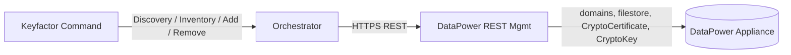

## Overview

The IBM DataPower Universal Orchestrator manages certificates on IBM DataPower appliances. It targets the appliance's REST Management Interface (typically port `5554`) and uses the same store-path model across every job type: `<domain>\<directory>`.



## Store Path Format

Every Inventory, Management (Add / Remove), and Discovery operation uses the same path shape:

```
<domain>\<directory>
```

| Part | Description | Examples |
|------|-------------|----------|
| **Domain** | A DataPower application domain. Every appliance has at least `default`; additional domains are created for environment / application isolation. | `default`, `production-api`, `staging` |
| **Directory** | The certificate store directory within that domain. | `cert`, `pubcert`, `sharedcert` |

### Per-Domain vs Appliance-Wide

Two of the three directories are **appliance-wide**: every domain can read them, but they are physically a single store owned by the `default` domain. Mutations (Add / Remove) through any non-default domain context are rejected by DataPower with `HTTP 403 Forbidden`. Discovery and the orchestrator's Add path enforce this:

| Directory | Scope | Discovery emits as | Contents |
|-----------|-------|--------------------|----------|
| `cert` | Per-domain | `<domain>\cert` (one per domain) | Domain-specific certificates and private keys, exposed as `CryptoCertificate` / `CryptoKey` configuration objects in that domain |
| `pubcert` | Appliance-wide | `default\pubcert` (once per appliance) | Public / trusted CA certificates the appliance uses to verify other parties |
| `sharedcert` | Appliance-wide | `default\sharedcert` (once per appliance) | Shared identity certs used by appliance-level services or every domain (e.g. the management-interface TLS cert, an enterprise-wide signing cert) |

So a 10-domain appliance produces **12** discovered store paths (10 × `<domain>\cert` plus `default\pubcert` and `default\sharedcert`), not 30.

> **Add / Remove against `<non-default>\pubcert` or `<non-default>\sharedcert`** is rejected by the orchestrator before the call leaves with `"You can only add to <store> on the default domain"`. This matches DataPower's actual permission model and keeps operators from chasing silent 403s.

## Discovery

Discovery enumerates all domains on the appliance, lists each domain's filestore, and emits a store path for every certificate-relevant directory.

### How It Works

1. **Enumerate domains** — `GET /mgmt/domains/config/` returns every application domain on the appliance.
2. **Resolve directory filter** — the comma-separated **Directories to search** field on the Discovery job is parsed; if blank, the orchestrator falls back to `cert,pubcert,sharedcert`. Trailing colons (`cert:`) are stripped before matching.
3. **List directories per domain** — `GET /mgmt/filestore/{domain}` returns every filestore *location*. The trailing-colon names returned by DataPower are matched against the resolved filter.
4. **Emit store paths** — `<domain>\cert` for every domain that has a `cert` directory; `default\pubcert` and `default\sharedcert` once each (other domains' views of those are skipped because they alias the same physical data).
5. **Submit to Command** — the discovered paths are sent back via `SubmitDiscoveryUpdate` for operator approval.

The orchestrator is resilient to one inaccessible domain: it logs a warning and continues with the rest.

### Configuration

Discovery only needs the appliance connection details — no store path is required:

| Field | Description |
|-------|-------------|
| **Client Machine** | DataPower appliance hostname/IP and REST mgmt port (e.g. `datapower.example.com:5554`) |
| **Server Username** | API username for DataPower (PAM-eligible) |
| **Server Password** | API password (PAM-eligible) |
| **Directories to search** | Comma-separated list of directory names to filter against (e.g. `cert,pubcert,sharedcert`). Leave blank to use the standard set. Custom DataPower scheme names can be included. |

The FlowLogger summary on the job's result records which filter list was applied:

```
[OK] ResolveDirsToSearch - source=user (key=dirs), dirs=[cert,sharedcert]
```

vs

```
[OK] ResolveDirsToSearch - source=default, dirs=[cert,pubcert,sharedcert]
```

## Inventory and Management

Inventory and Add / Remove jobs target a specific store path. The orchestrator branches on the directory:

- `<domain>\cert` and `default\sharedcert` → reads `CryptoCertificate` config objects from `/mgmt/config/{domain}/CryptoCertificate`, filters to those whose `Filename` URI scheme matches the store (so a `default\sharedcert` job ignores the `cert:///` and `pubcert:///` entries that share the domain), and submits the certs.
- `default\pubcert` → reads files directly from the `pubcert:` filestore.

Every job emits a `[FLOW:...]` breadcrumb summary that is appended to the `JobResult.FailureMessage` regardless of success or failure. The summary lists every step (Validate, ParseConfig, CreateApiClient, GetCerts.ParseResponse, GetCerts.SubmitInventory, ...) with timing and any error reason. Operators can read it directly from the job-history pane in Command without enabling Trace logging.

### Optional Store Properties

| Property | Description |
|----------|-------------|
| **Inventory Black List** | Comma-separated alias names to exclude from Inventory results (e.g. `system-cert,internal-test`). Case-insensitive. Empty by default. |
| **Inventory Page Size** | Maximum number of certs returned per Inventory submission. Defaults to `100`. |
| **Public Cert Store Name** | Name of the appliance's public-cert directory (default `pubcert`). Override only if the appliance has been re-configured. |
| **Protocol** | `https` (default) or `http`. Use `http` for lab appliances without the REST mgmt TLS profile configured. |

## Migration Note

Earlier releases of this orchestrator emitted `<each-domain>\pubcert` and `<each-domain>\sharedcert` from Discovery — N copies all aliasing the same physical store. If your environment has previously approved any of those non-default entries as cert stores in Command, they are now orphans:

- Inventory against them returns nothing (the underlying objects all point at `<scheme>:///` paths owned by `default`).
- Add and Remove are rejected by the orchestrator with a clear message.

Re-run Discovery, approve the canonical `default\pubcert` and `default\sharedcert`, and remove the duplicates from your Command instance.
